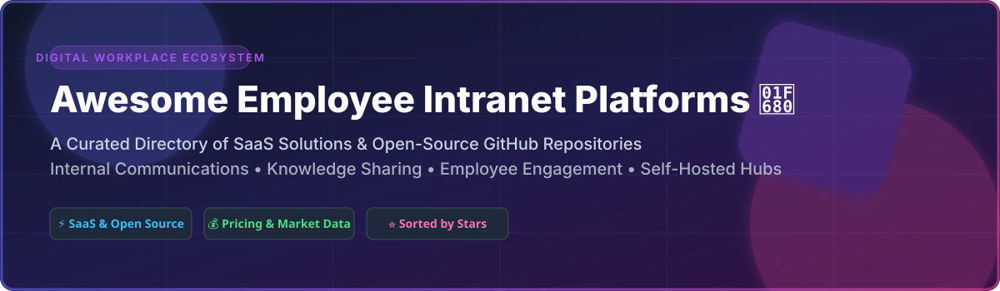

# 🚀 Awesome Employee Intranet Platforms Ecosystem

  
  
  
  

## 🌐 Top Employee Intranet Platforms & Digital Workplace Solutions

**Curated List of Enterprise SaaS Products & Open-Source GitHub Projects**  
*Focused on Employee Communication, Digital Workplace, Knowledge Sharing, Enterprise Search & Internal Collaboration*  
**Last updated: September 2026**

This repository tracks notable **SaaS platforms** and **open-source projects** for **Employee Intranet Platforms**. These tools help organizations connect employees, streamline internal communication, share knowledge, and build digital workplace experiences that engage both desk-based and frontline workers.

---

## 📊 Market Overview & Industry Structure

> **Market Size & Fragmented Dynamics**: The global Employee Intranet and Experience Platform market is estimated at **$18.5 Billion (2026)** and is projected to reach **$34.2 Billion by 2030** (CAGR ~13.1%). The sector is **moderately fragmented**: while legacy suites (like Microsoft 365/SharePoint) hold high enterprise distribution, a wide ecosystem of specialized SaaS platforms (Simpplr, Staffbase, Unily) and vibrant self-hosted open-source software compete actively for specialized enterprise and privacy-conscious niches.

---

## 📜 Table of Contents

- [🏢 SaaS/Hosted Platforms](#-saashosted-platforms)
- [🔓 Open-Source GitHub Projects](#-open-source-github-projects)
- [🤝 How to Contribute](#-how-to-contribute)
- [💖 Support & Sponsorship](#-support--sponsorship)
- [📈 Star History](#-star-history)
- [⚠️ Disclaimer](#%EF%B8%8F-disclaimer)

---

## 🏢 SaaS/Hosted Platforms

| Platform | Description & Key Features | Valuation / Est. Revenue | Starting Pricing | Free Tier / Trial Limit |
| :--- | :--- | :--- | :--- | :--- |
| **[Staffbase](https://staffbase.com/)** | 🚀 AI-native employee experience platform connecting 2,000+ companies via mobile app, intranet, and AI services. | **$1.1B+ Valuation** ($100M+ ARR) | From ~$8.00 / user / month | 14-day free trial (Full features, no credit card) |
| **[Simpplr](https://www.simpplr.com/)** | 🧠 AI-powered employee experience platform combining intranet, internal comms, and enterprise search across SharePoint/Google Drive. | **$600M+ Valuation** ($70M+ ARR) | From ~$8.00 / user / month | 14-day free trial (Custom sandbox demo available) |
| **[Unily](https://www.unily.com/)** | 🏢 Enterprise employee experience platform trusted by British Airways & Shell; featuring multi-channel content Campaigns. | **$500M+ Valuation** ($60M+ ARR) | From ~$5.00 / user / month | 30-day proof-of-concept enterprise trial |
| **[Haiilo](https://www.haiilo.com/)** | 📣 Social intranet and employee advocacy platform driving engagement through behavioral insights (merger of COYO & Smarp). | **$300M+ Valuation** ($45M+ ARR) | From €4.50 (~$5.00) / user / month | 14-day free trial (Full access) |
| **[LumApps](https://www.lumapps.com/)** | 🌐 Unified digital workplace platform aligning brand guidelines, streamlining workflows, and integrated with Google Workspace & M365. | **$250M+ Valuation** ($40M+ ARR) | From ~$6.00 / user / month | 14-day free trial |
| **[Igloo Software](https://www.igloosoftware.com/)** | 📁 Gartner Magic Quadrant Visionary digital workplace platform focusing on internal communications and knowledge management. | **$150M+ Valuation** ($30M+ ARR) | From ~$12.00 / user / month | 30-day free trial (Up to 10 users) |
| **[Interact Software](https://www.interactsoftware.com/)** | 💬 Established enterprise intranet provider focusing on employee engagement, internal communication, and knowledge sharing. | **$120M+ Valuation** ($25M+ ARR) | From ~$6.00 / user / month | 14-day interactive trial environment |
| **[Akumina](https://www.akumina.com/)** | ⚡ Personalized digital workplace platform with deep Microsoft 365 integration and no-code intranet configuration. | **$100M+ Valuation** ($20M+ ARR) | From ~$5.00 / user / month | 30-day sandbox trial |
| **[ThoughtFarmer](https://www.thoughtfarmer.com/)** | 🌲 Intranet platform designed for hybrid and remote teams to build workplace culture and streamline internal communication. | **$60M+ Est. Valuation** ($12M+ ARR) | From $10.00 / user / month | 14-day free trial (Up to 50 users) |
| **[Claromentis](https://www.claromentis.com/)** | 🛠️ Digital workplace platform combining intranet, document management, learning management (LMS), and business process automation. | **$40M+ Est. Valuation** ($8M+ ARR) | From $1.50 / user / month (min $1,500/mo) | 14-day free trial (Full suite access) |

---

## 🔓 Open-Source GitHub Projects

Sorted by GitHub_Stars (descending) 🌟

- **[Rocket.Chat](https://github.com/RocketChat/Rocket.Chat)**   
  💬 Enterprise open-source communications and team collaboration platform with channels, video calls, matrix federation, and custom intranet integrations. **GPL-3.0**

- **[Outline](https://github.com/outline/outline)**   
  📝 Modern, lightning-fast collaborative knowledge base and team wiki built with React and Node.js. Ideal foundation for company documentation. **BSL-1.1**

- **[Wiki.js](https://github.com/requarks/wiki)**   
  📚 Highly extensible, modern open-source wiki app built on Node.js, Git, and PostgreSQL for internal corporate documentation. **AGPL-3.0**

- **[Docmost](https://github.com/docmost/docmost)**   
  📄 Open-source collaborative workspace and documentation software. An open-source alternative to Confluence and Notion. **AGPL-3.0**

- **[BookStack](https://github.com/BookStackApp/BookStack)**   
  📖 Simple, self-hosted, hierarchical documentation platform organized by Books, Chapters, and Pages. **MIT**

- **[HumHub](https://github.com/humhub/humhub)**   
  👥 Flexible open-source social network kit written in PHP (Yii framework). Used extensively as a corporate social intranet with 70+ modules. **AGPL-3.0**

- **[eXo Platform](https://github.com/exoplatform/platform)**   
  🏛️ Full-featured open-source digital workplace & enterprise social intranet with document management, modern news wall, matrix chat, and PWA mobile app. **LGPL-2.1**

- **[Pladigit](https://github.com/jpbosse/pladigit)**   
  💼 Comprehensive open-source digital workplace platform for public sector organizations replacing SharePoint with project management, photo libraries, GED, and Collabora Online. **AGPL-3.0**

- **[OpenIntranet](https://github.com/openintranet/openintranet)**   
  🏛️ Free workplace intranet hub built on Drupal & Symfony. Centralizes enterprise news, documents, employee directories, events calendar, and RAG AI search. **GPL-2.0**

- **[OpenHive](https://github.com/arseneHuot/openhive)**   
  🐝 Self-hosted team communication hub built on Supabase with LiveKit video integration, Slack-like threads, channels, and webhooks. **MIT**

- **[Simoona](https://github.com/VismaLietuva/simoona)**   
  🎉 Smart social intranet solution powered by Visma featuring social walls, employee directories, and Kudos peer recognition gamification. **MIT**

- **[Dango](https://github.com/magland/dango)**   
  🍡 Lightweight self-hosted team chat with channel structure, SSE live delivery, and zero database requirements. **MIT**

---

### 🧩 Custom Intranet Architectural Frameworks

Organizations building modern self-hosted intranet ecosystems can combine:
- **Core Intranet Hub**: **eXo Platform** or **OpenIntranet**
- **Knowledge & Wiki**: **Outline** or **BookStack**
- **Social & Engagement**: **HumHub** or **Simoona**
- **Real-Time Messaging**: **Rocket.Chat** or **OpenHive**
- **Document Suite**: **OnlyOffice** or **Collabora Online**

---

## 🤝 How to Contribute

1. Fork the repository.
2. Add/edit entries in `README.md` (follow existing tabular and link formats).
3. Include: Name, website/GitHub link, description, and accurate pricing/Stars_Badges.
4. Open a Pull Request with a clear summary of additions.

Refer to [https://github.com/ishandutta2007/Awesome-Awesome-Awesome](https://github.com/ishandutta2007/Awesome-Awesome-Awesome) for contribution guidelines.

---

## 💖 Support & Sponsorship

If you find this curated intranet ecosystem list helpful, please consider supporting the project:

- ⭐ **Star** this repository to increase visibility.
- 🔀 **Fork** and contribute new tools or updates.
- 📢 **Share** with internal comms leaders, HR tech teams, and IT architects.
- ☕ **Buy me a coffee**: Support ongoing open-source maintenance via [GitHub Sponsors](https://github.com/sponsors/ishandutta2007).

Thank you to all community contributors and maintainers! 🙌

---

## 📈 Star History

---

## ⚠️ Disclaimer

- This is a **community-curated** list — not exhaustive and not an explicit commercial endorsement.
- Intranet platforms process sensitive employee and organizational data; ensure compliance with security governance (GDPR, SOC 2, CCPA).
- Self-hosting open-source solutions requires technical investment in server infrastructure, security patches, and maintenance.

---

  <b>Built with ❤️ for internal communications teams, HR leaders, IT administrators, and digital workplace strategists.</b>

